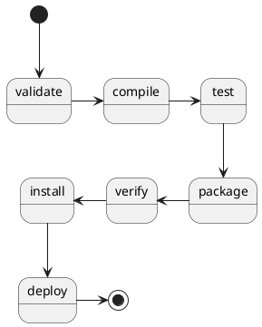

Notes about the SpringBoot framework in specific. Some of these topics
might be useful in other frameworks as well which use the MVC principals.

## dependencies

There are currently two methods of organizing dependencies for a SpringBoot project:

1. Maven
2. Gradel

I have chosen to go with Maven for now since it seems more popular, but I will say
that Gradel looks vastly streamlined and simplified which is great. Even though
its simplified, the pain points of Maven have been overcome with a decent IDE
that will just add the entries for you. So, I think in this area, go with
what your team decides to support.

### Maven

The key file that maven uses is the `pom.xml` file at the root level of
your project. Here is a structure of the addons or libraries your app
will use to reference and which version of Java to be used for the
project.

Some commands to up date your list of installed/downloaded libraries
are as follows:

```bash
# install the dependencies
mvn dependency:tree
# build the jar
mvn build
# to start the app
mvn spring-boot:run
```

Mavens lifecycle has the following steps:



## directory structure

* src/main/java/com.pluralsight.conferencedemo/models
* src/main/java/com.pluralsight.conferencedemo/controllers
* src/main/java/com.pluralsight.conferencedemo/repositories
* src/main/java/com.pluralsight.conferencedemo/services

## Controllers

### Purpose

respond to requests for their given path

### Annotations

### StatusCodes

The following example allows for you to return a status code of `201` for `created` instead of the standard
status code of `200`.

```java
@PostMapping
@ResponseStatus(HttpStatus.CREATED)
public Session create(@RequestBody final Session sessions) {
    return sessionRepository.saveAndFlush(session);
}
```

## Customization

To set custom environment variables for a SpringBoot application, there is a order of precedence that should be considered:

1. Command line args
2. SPRING_APPLICATION_JSON args
3. Servlet parameters
4. JNDI
5. Java System Properties
6. OS environment variables
7. Profile properties
8. Application properties
9. @PropertySource annotations
10. Default Properties

One pattern to choose is to:

* Pick one interal source to set defaults
* Pick one external to set the overrides

This allows you to have a list of variables that you can control without having too many surprizes.

### properties

[Appendix-Application-Properties](https://docs.spring.io/spring-boot/docs/current/reference/html/appendix-application-properties.html)

Overriding properties is pretty simple:

add the following to the `src/main/resources/application.properties` file to set the default server port to
a value of `5000`:

```java
server.port = 5000
```

To set logging levels for your application your best bet is to use the `application.properties` file.
SpringBoot allows you to create multiple profiles for selecting which profile you would like to
use. Below are some examples of how to set your logging levels:

```shell
logging.level.org=WARN
```

Now when you start your application, you should find the following similar output:

```shell
  .   ____          _            __ _ _
 /\\ / ___'_ __ _ _(_)_ __  __ _ \ \ \ \
( ( )\___ | '_ | '_| | '_ \/ _` | \ \ \ \
 \\/  ___)| |_)| | | | | || (_| |  ) ) ) )
  '  |____| .__|_| |_|_| |_\__, | / / / /
 =========|_|==============|___/=/_/_/_/
 :: Spring Boot ::        (v2.3.4.RELEASE)

2020-11-08 11:02:49.017  INFO 66643 --- [           main] c.p.c.ConferenceDemoApplication          : Starting ConferenceDemoApplication on macbook-pro.lan with PID 66643 (/Users/addlema/src/git.autodesk.com/conference-demo/target/classes started by addlema in /Users/addlema/src/git.autodesk.com/conference-demo)
2020-11-08 11:02:49.019  INFO 66643 --- [           main] c.p.c.ConferenceDemoApplication          : The following profiles are active: prd
2020-11-08 11:02:50.637  WARN 66643 --- [           main] JpaBaseConfiguration$JpaWebConfiguration : spring.jpa.open-in-view is enabled by default. Therefore, database queries may be performed during view rendering. Explicitly configure spring.jpa.open-in-view to disable this warning
2020-11-08 11:02:50.846  INFO 66643 --- [         task-1] com.zaxxer.hikari.HikariDataSource       : HikariPool-1 - Starting...
2020-11-08 11:02:50.995  INFO 66643 --- [         task-1] com.zaxxer.hikari.HikariDataSource       : HikariPool-1 - Start completed.
2020-11-08 11:02:51.974  INFO 66643 --- [           main] c.p.c.ConferenceDemoApplication          : Started ConferenceDemoApplication in 3.27 seconds (JVM running for 3.535)
```

Take note that even though we selected `WARN` level, we are still seeing `INFO` for the `com` namespace. Our
settings are applied to the `org` namespace and will not be applied to the `com` space.

## VSCode

### ENVs

To set these environment variables to be used with VSCode, you need to create the following file
of `.vscode/launch.json` and use something similar to below:

```json
{
    "configurations": [
        {
            "type": "java",
            "name": "Spring Boot-ConferenceDemoApplication<conference-demo>",
            "request": "launch",
            "cwd": "${workspaceFolder}",
            "console": "internalConsole",
            "mainClass": "com.pluralsight.conferencedemo.ConferenceDemoApplication",
            "projectName": "conference-demo",
            "args": "",
            "env": {
                "DB_URL": "jdbc:postgresql://localhost:5432/conference_app"
            }
        }
    ]
}
```

### Profiles

To set different application.properties files for various environments the following pattern is
to create a file in the `src/main/resources` with the naming convention of
`appliation-NAME.properties` where **NAME** would be the name of your enviornment. For example
to set the properties for a Production environment you would create a file name of
`application-prd.properties` or `application-prod.properties`. What ever you choose for the name
would also be used in the `.vscode/launch.json` file as follows.

(this example is using `prd` as the name for the `--spring.profiles.active` argument is set
to the value of `prd`)

```json
{
    "configurations": [
        {
            "type": "java",
            "name": "Spring Boot-ConferenceDemoApplication<conference-demo>",
            "request": "launch",
            "cwd": "${workspaceFolder}",
            "console": "internalConsole",
            "mainClass": "com.pluralsight.conferencedemo.ConferenceDemoApplication",
            "projectName": "conference-demo",
            "args": "--spring.profiles.active=prd",
            "env": {
                "DB_URL": "jdbc:postgresql://localhost:5432/conference_app",
                "DB_USER": "postgres",
                "DB_PASS": "welcome"
            }
        }
    ]
}
```

If its `yaml` you prefer, SpringBoot will also pick up on the file
of `application.yml` as well:

```yml
server:
    port: 5000
```

Best to keep to one type instead of mixing `.properties` with `.yml` and lower the
confusion.

## deployment

Default container for SpringBoot is `Tomcat`, but there are others like:

1. Jetty
2. Undertow
