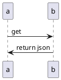

---
# Course title, summary, and position.
linktitle: Plantuml
summary: Make diagrams from code
weight: 1

# Page metadata.
title: Overview
date: "2020-11-07T07:24"
lastmod: "2020-11-07T07:24"
draft: false  # Is this a draft? true/false
toc: true  # Show table of contents? true/false
type: docs  # Do not modify.

# Add menu entry to sidebar.
# - name: Declare this menu item as a parent with ID `name`.
# - weight: Position of link in menu.
menu:
  plantuml:
    name: Plantuml
    weight: 1
---

Make diagrams with code. Compare this to the other tools, I find this method for drawing flow diagrams
very helpful with regards to technical projects. There is tons of value in saving a diagram in a source
version manager like Git and be able to generate the diagram. Additionaly, there are many parsers that
come with other content management systems which render the UML. One example is using the macro in
Confluence to render the UML as an image.

Below is a small example of code with its generated image:

