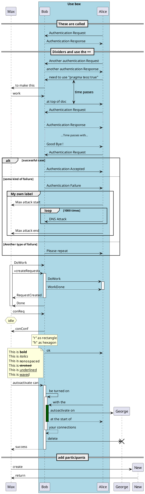

## kitchen sink

Trying to show as much as I can with the useful features of Plantuml for
a referance purpose with a visual aide.

```plantuml
@startuml
!pragma teoz true

== These are called ==

Alice -> Bob: Authentication Request
Bob --> Alice: Authentication Response

== Dividers and use the == ==

Alice -> Bob: Another authentication Request
Alice <-- Bob: another authentication Response

{start} Alice -> Bob : need to use "pragma teoz true"
Bob -> Max : to make this
Max -> Bob : work
{end} Bob -> Alice : at top of doc

{start} <-> {end} : time passes

Alice -> Bob: Authentication Request
...
Bob --> Alice: Authentication Response
... ...Time passes with... ...
Bob --> Alice: Good Bye !

box "Use box" #LightBlue
participant Bob
participant Alice
end box


Alice -> Bob: Authentication Request

alt successful case

    Bob -> Alice: Authentication Accepted

else some kind of failure

    Bob -> Alice: Authentication Failure
    group My own label
    Alice -> Max : Max attack start
        loop 1000 times
            Alice -> Bob: DNS Attack
        end
    Alice -> Max : Max attack end
    end

else Another type of failure

   Bob -> Alice: Please repeat

end

Max -> Bob: DoWork
activate Max

Max -> Bob: << createRequest >>
activate Bob

Bob -> Alice: DoWork
activate Alice
Bob --> Alice: WorkDone
deactivate Alice
destroy Alice

Bob --> Max: RequestCreated
deactivate Bob

Bob -> Max: Done
deactivate Max

Max -> Bob : conReq
hnote over Max : idle
Max <- Bob : conConf
rnote over Bob
 "r" as rectangle
 "h" as hexagon
endrnote

Bob -> Alice : ok
note left
  This is **bold**
  This is //italics//
  This is ""monospaced""
  This is --stroked--
  This is __underlined__
  This is ~~waved~~
end note

autoactivate on
Max -> Bob : autoactivate can
Bob -> Bob : be turned on
Alice -> Bob #005500 : with the
Bob -> George ** : autoactivate on
return at the start of
return your connections
Bob -> George !! : delete
return success
autoactivate off

== add participants ==
create New
Max -> New: create
New -> Max: return
@enduml
```
