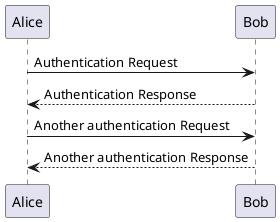
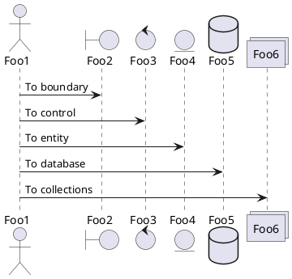

Used mostly for describing the process of a GET or POST verbs of a project.
Here are some examples I use for making these diagrams:

## simple

Plain example of some interactions between Bob and Alice.

## participants

