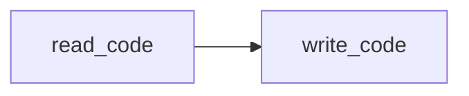
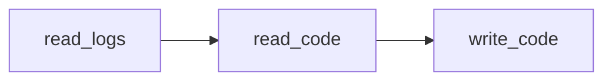
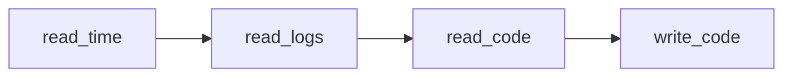
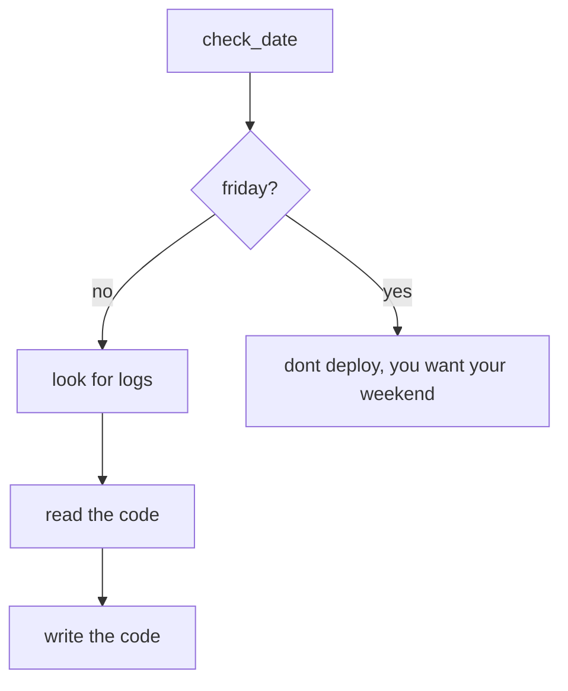

## Making a change

I would assert the following patterns are true when making
a change of _any_ project:

1. you read more code than you write code
2. you read logs more than you read code
3. you read the timestamps more than you read logs

### read more than write

After you have written code, your going to read it over, and over ... and over again for each change you make.
As your changes stack up, your number times you read the code increases way beyond the number of changes.
This is what I mean by you read more code than you write code.

### read logs more than read code

After you have read your code tons of times this means you have made less than tons of changes.
Most likely you have also executed your code and tried to understand what it has done.
Usually, we all make logs to understand what our code has done.
By keeping your logs in a clean and meaningfull format, you help out the first rule of _reading more than you write_ by understanding where your log event exists within your code.

### read time more than read logs

Very quickly you come to the next run of your code and the timestamp has changed.
When did these logs print out? By reading the timestamp of all the logs you have you are now reading more timestamps than you are reading logs more than you are reading code more than you writing code.

## summary

All of this boils down to some simple rules:

> When making a change

1. Check the current date (aka not friday)
2. Review log events matching around current date and set expectations of events
3. Locate the log events by reading the code
4. Write the code you need to change

## pipelines

When building pipelines, I notice many issues crop up when the project starts to put tons of logic into the CI/CD script and not into a tool.
This causes the jobs to be com brittle and will easily break or become
out dated fast. Espectially when treating the job in CI/CD with different Git branches. This pattern is absolutly horible because
now the changes to the branch have to receive updates from other
branches and causes a merging nightmare of timelines within git.

Best patterns are to make a tool that is external to the pipeline.
I really like the idea of GoLang to do the heavly lifting as this tool
could also run locally and has a better chance of being cross-complied.
You could go the container route as well. I dont really care, but just
not the CI/CD language itself or individual git branches.

## backups

Unless you restore from your backup source, it does not exist.
What this means is your backup will never hold meaning until you know it works.
The best possible scenario is doing deployments from a backup of your data within a cold environment, validate your data and service expectations, then destroy.
An even better possibility is to deploy from a backup and overlay the data from the live envionment.
Essentiall you are running a disaster recovery on a repeating schedule.
The better you are at doing this, the easier you are at recoverying from a disaster.

## nothing stays the same

I am constently surprised at how many people I meet that believe nothing (or very little) will change.
How futher they are from the truth.
All things in life change.
This is the thing that keeps life moving forward withing time.
Within the world of technology this is magnified to an intese degree.
