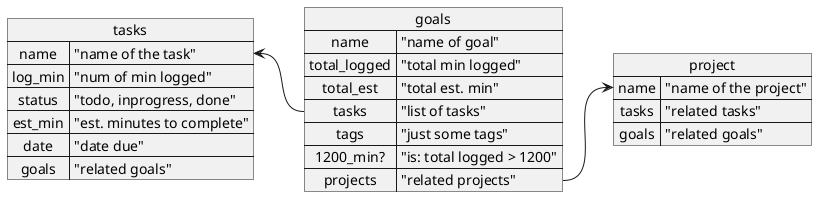
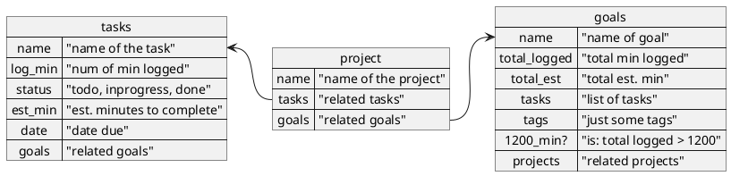
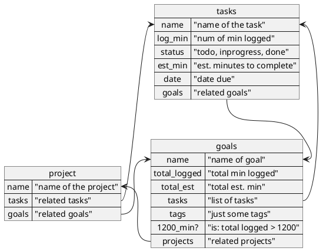

**tl;dr**

> It takes 10k hours to become an expert. Well sometimes I don't need to become an expert. I just need to be familiar. So I'm going to commit 20 hours.

Make 3 databases that track your notes in tasks as you log progress in a project which is related to goals to reach your desired time. Each goal has their own amount of hours you want to dedicate for learning or completing.

## Summary

Taking notes, making progress, its what helps us measure when we grow. What did I learn when I read/watched that thing? How much have I done with this one project? These were questions that came up while inventing projects to work on. What goals does this project contribute while completing these tasks? What tasks should I do that move me closer to the goals I want to complete?

Beyond these words I will go into how I built a nice system to answer all these questions as I want to learn more topics that align with my interests.

## The system

No, its not "the super system" idea or a "GTD" type thing. It is just a combination of 3 databases that interact with each other. Do I keep tasks in Notion to remind me of what is next? The answer is no. Notion helps be the place to capture things I am *working on* as a infinite notebook with a calendar, projects, tasks (maybe even considered assignments that have notes attached to them) with metadata of estimated hours and logged hours (more on that below).

## What is notion.so

Not going to spend lots of time here as [Notion.so](https://notion.so) does a great job describing their own strengths. In short I will say its a wiki based platform that combines blocks of things (text, images, databases) onto pages. Their current pricing right now (as of this article date) is free for personal use which really fits my budget quite well.

## But why have projects and goals?

Having projects is great because they are focused on one specific thing with a very clear result of completion: getting to done. In my solution, I am treating a goal as a skill or thing you want to accomplish that include multiple projects. The best example I can think of is the goals of Math, Finance, and Programming. These are all goals I want to improve on and are associated with a project of Python Finance. I have set my own parameters of these goals for completing them by the total number of minutes contributed to the goal(s).

## How does it work

I have three tables which are called _Projects_, _Tasks_, and _Goals_. Each one of the tables has few or many fields that related to the others. Some are straight forward while others are roll-ups which allow you to select records from another table as reference. All of this allows you to build a complete picture of what goals you want to accomplish that have tasks, which are driven by goals you want to achieve. When done this way, you will end up with a list of tasks _that you want to do_ which move your progress to completing projects which align with your goals.

Below are sub sections for each table with their columns and description of how their relationship work with each other. For added explanation, I have also added a diagram to illustrate the relationships each table have. This took a bit of time and realized the tool I have selected for diagraming the fields relationships made for very confusing diagram if all displayed at once. So I decided to break up the relationships by each table. At the bottom, I show the entire picture that I find very confusing if that is of any help to you.

Inside of Notion's databases, you can define columns of many different types. Most of them capture various different types of media: Text, Date, Attachments. Then there are some that help *_link_* the column or database to other databases. These types of fields are either *_Relationship_* or *_Rollup_* and they are super helpful once you know what they can do.

### Create some goals

What do you want to learn over many years? This is the table where you list things you want to log 1200 minutes. Ever heard the expression it takes 10000 hours? Well, thats if you want to become an expert, and in the process its your future career.  If thats the case, I raise my glass to you and cheer you on. But if you want to just get a little more familiar with a topic or skill, I have picked up people suggesting 20 hours, which equals 1200 minutes. This field can be altered for each goal which makes the system so customizable!

Name
: Name of the goal

Tasks
: Relationship to Tasks table

Total Logged
: Rollup of Tasks log min calculated with sum

Total Est
: Rollup of Tasks est. min calculated with sum

1200 min?
: Formula calculating the total minutes completed. `if(prop("Total logged") > 1200, "yes", "no")`

Last Changed
: Not really used, just more info

Related to Projects
: Relationship to Projects

*Why minutes?* you might be asking. Well I have plans in the future to log progress as I continue my goals and wanted to a very simple way to calculate the progress. I think also a ton of time has passed and I have forgotten about some other reasons. Perhaps some innovation could be applied here with your implementation.

### Create some projects

> What is something you want to work on?

Project based work is great because its very specific with its goal: Make this thing. It should be short and to the point. Ideally 1-5 months, but that is my opinion. Lets use learning a new language as an example. The name of the project would be *_Learn Spanish - Small Talk_*. This project would be associated with a goal of something like "Speak different Languages" or "Fluent in Spanish". The goals part is really trying to give a number to how many hours across multiple projects. This gives us the ability to create projects of specific end states. Speaking Spanish might just be one project and another could be writing Spanish.

Name
: Name of the projct

Goals
: What goals does this project apply towards?

Related to tasks
: What tasks are needed to get done to call this project done?

Total minutes
: Relationship to tasks #log minutes

Status
: Backlog, InProgress, or Done

### Now make some tasks

> What task(s) are you going to do that apply to a project?

This is where you get down to the fine detail of each task you want to capture. Here is where you have both a task to complete and the ability to link it to a notebook for tracking progress. If your notes are directly related to the specific task, then keep them in the task. However, if you want to use these notes in the future and not sift or search inside your tasks, I _*highly suggest*_ to not keep your notes inside the task.

Name
: Name of the task

Status
: Backlog, InProgress, or Done

Est. Minutes
: How many minutes do you think it will take?

Date
: When is it due or scheduled

Goal
: What goal is it associated with? This might be redundant. Its up to you if you want more information.

Projects
: What project is this related to?

Project Status
: Rollup from the Project status field. Helpful for filtering the Tasks by what status the projects are in.

## The diagram

