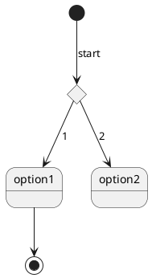

Creating graphs and flow charts or sequence diagrams can go a long way, but making them can be a pain. Instance feedback allows us to lower the resistance of making more diagrams. I offten visit [plantuml.com](plantuml.com) for suggestions and put up with the ads surrounding the examples. 

But instead, I have decided to make my own library of examples and along the way share with you the setup I use with VSCode for makiing a live preview which makes for editing graphs much easier.

## Install extension

To enable VSCode to do a live preview of your PlantUML graph I have been using the extension **Markdown Preview Enhanced**. 

Once installed, you can open a Markdown file, and fill with code like the example below, the run use the command pallet **Markdown: Markdown Preview Enhanced: Open preview to the side** and you will have a new tab showing your finished work.

## Sequences

Used for showing a stack of actions between end points. Below is a kitchen sink of everything I found for the sequence.

1. notes to the left, center, right, and other styles/shapes
2. dividers
3. anchors, duration, and delays
4. encompass
5. absence of foot boxes
6. padding
7. groups in stages or across nodes
8. lifeline activation and destruction
9. participants/actors/boundry/control/entity/database
10. color backgrouns for nodes
11. setting the order
12. self
13. text alignment
14. arrow styles and color
15. sequence numbering
16. page title, header, and footer
17. splitting pages

<uml>
a --> b
note left of a: this is a note
</uml>

