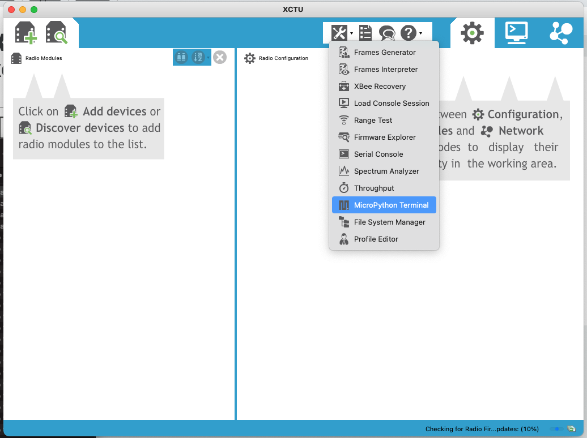
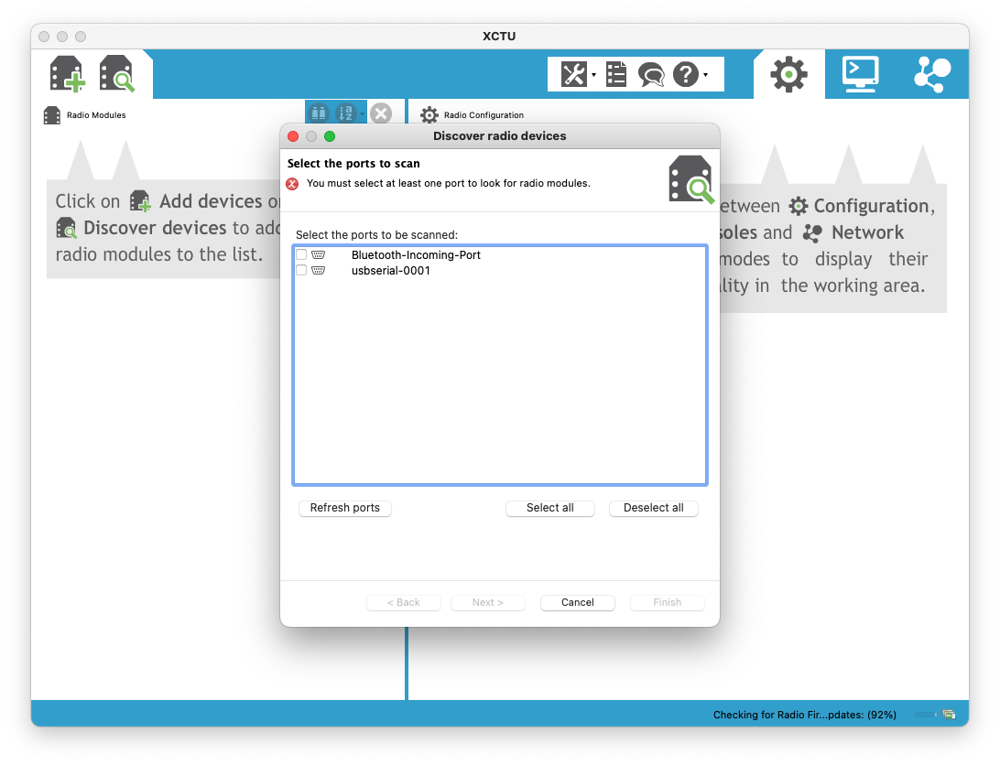
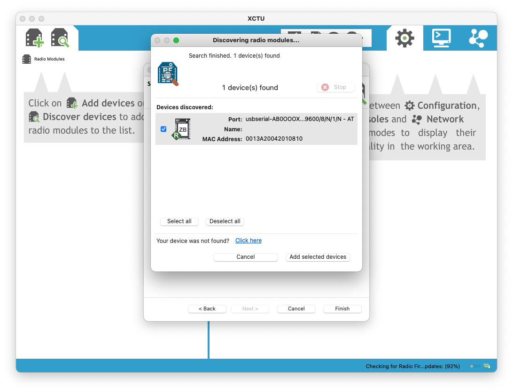
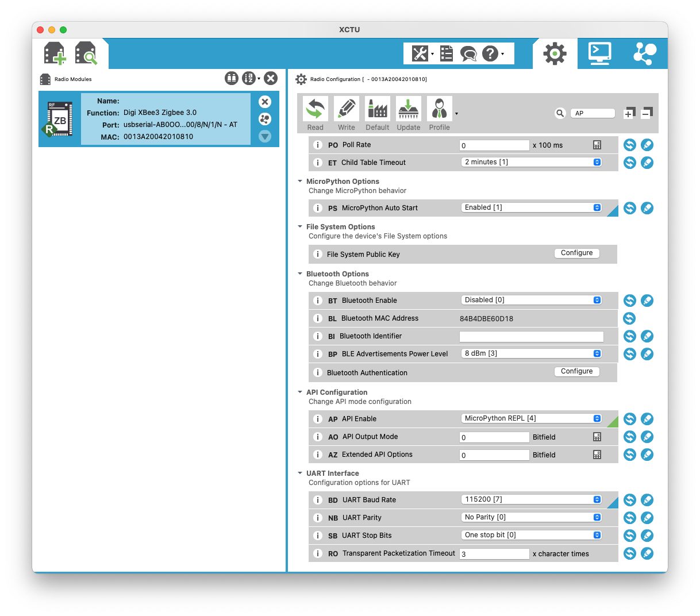
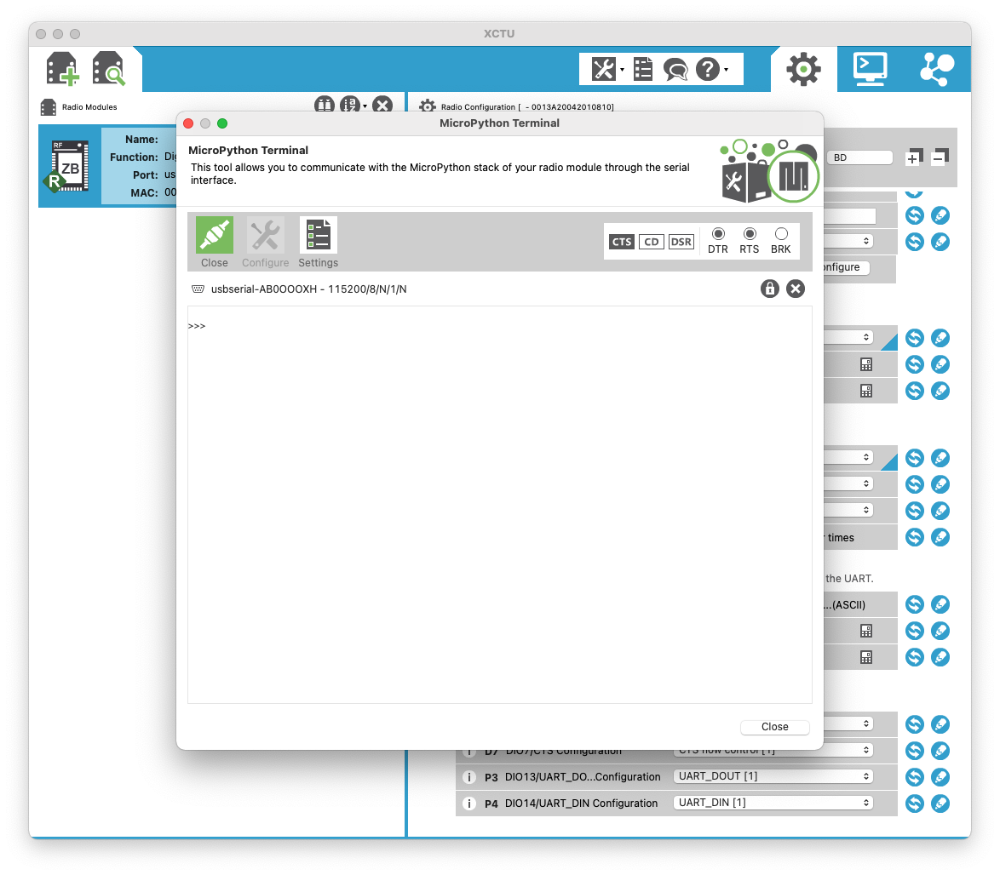

## Summary

I want to get into automation of watering my indoor plants. I thought about his problem and had the idea
of going a couple of directions. One option was with Raspberry Pi. While this option would be really easy,
I did not like the idea of having to use up IP addresses in my house. I mean, its possible to throw in
router and for them to be on a separate network, but I really like the idea of XBee and extending the network
each time I add a new node.

## XBee and the kit I got

I purchases an XBee kit from Mouser and it just arrived. From here, I have written the content as I learned
more about this system.

## Getting started

### Video

Found this video stream on YouTube: https://www.youtube.com/watch?v=eACvW0whXRI

### Guided info

Visited the link https://www.digi.com/products/embedded-systems/digi-xbee/rf-modules. Now.. what thing do I download?
I see 5 options:

1. Digi XBee 3 Zigbee 3 RF Module
1. Digi XBee 3 802.15.4 RF Module
1. Digi XBee 3 DigiMesh 2.4 RF Module
1. Digi XBee-PRO Zigbee
1. Digi XBee-PRO DigiMesh

After reading more information, I see that the 4th and 5th options are for professional applications of hardware. That leaves me with 1-3. Looking at the chip in the middle of my board, I see the words "Zigbee 3". Whohoo! Going with "Zigbee 3 RF Module".

Going to their support link of https://www.digi.com/products/embedded-systems/digi-xbee/rf-modules/2-4-ghz-rf-modules/xbee3-zigbee-3#support gave me options for downloading some resources. I went for the user manual of "XBee 3 Zigbee 3.0 Module User Guide" located at https://hub.digi.com/support/products/digi-xbee/digi-xbee3/?path=/support/asset/xbee3-zigbee-30-module-user-guide/ which lets you view or subscribe to this document. The actual document is located at https://www.digi.com/resources/documentation/digidocs/90001539/

### Noteworthy information

After moving through the table of contents, I found out about the XCTU which

> is a multi-platform program that enables users to interact with Digi radio frequency (RF) devices through a graphical interface. The application includes built-in tools that make it easy to set up, configure, and test Digi RF devices.

Found a YouTube video about the software as well: https://www.youtube.com/watch?v=X_fHDvV_q98

Downloading XCTU software is located at https://www.digi.com/products/embedded-systems/digi-xbee/digi-xbee-tools/xctu#productsupport-utilities

## Getting it running

Installation of the MacOS version was really simple. I caught a brief note or term of the word "eclipse" which makes me think this is an application built on top of the Eclipse editor and probably is Java based. I find this to be a pretty stable idea because Eclipse is a very popular platform/editor and would give longevity to the project's future update and being cross OS compatible.

Launching the program and looking around for the first time I noticed there is an option for a MicroPython terminal! Fantastic news as now I might point my idea to using Python for my plant watering project.

Okay, so far so good. Now, it looks like I need to add a device. What happens if I just power one device on and see if it auto discovers it?

Offered to select a device for scanning... hmm this makes me thing I need a XBee host for connection. I happen to have one that is hooked up to my Home Assistant at this time and perhaps using that would be helpful here. After plugging it in and re-scanning the ports, I found a new device!

Going to choose it and see what I get..... and I got nothing. Okay, I am getting ahead of myself...back to the manual...

Okay!!! After reading just a little bit of the XCTU manual, I realized that you can plug the XBee module directly into the USB port of my Mac and then scan! Here is what I got:

Immediately I was able to update the firmware with the latest version... After poking around for a little bit of time, I found out that I could browse the filesystem of the XBee device, but it had to be formatted first. My guess is this is where I can place my Python scripts or Java applications for execution.

SUCCESS!! I got the Python prompt to show up over the serial port! Had to change a couple of things and here are some screenshots to show it. After writing these changes and restarting the board (I dont know if I had to do that or not, but just being safe.) I got to a `>>>` and I was so happy.

Here is a small list and screenshots of what I changed:

1. Set the "BD" baud rate to `115200`
1. Set the "AP" API enable to `MicroPython REPL [4]`

## Conclusion and what is next

Okay, so not bad at all for my first time with XBee and some work on the weekend. I also did some quick reading about the "Grove" system and will try to get a moisture sensor for soil to hook up to this board.

Next steps I think for my project here is to put some MicroPython on the board and see what I can run!
